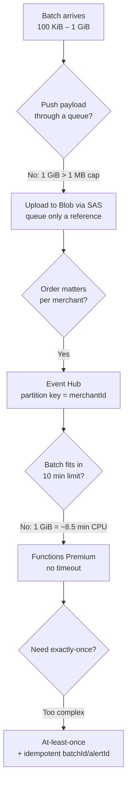
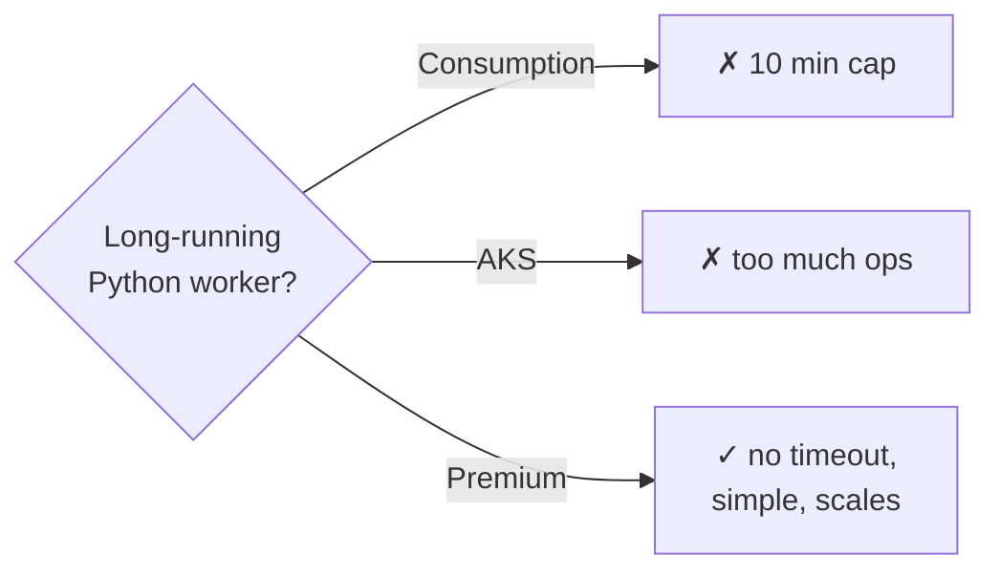

# Design Rationale — Why We Built It This Way

**Team:** Simona Strečanská, Martin Lejko
**Companion to:** [`semestral-project-assignment-b.md`](./semestral-project-assignment-b.md)

This file explains *why* we made each choice. The main file is *what* we built. We follow the course rule: when two options work, pick the simpler one.

---

## How a batch flows through the decisions

---

## Decision records

### D1 — Upload batches to Blob, queue only a reference

**Why:** Event Hub messages cap at ~1 MB. Batches reach 1 GiB. Pushing the payload through the queue is impossible. So the merchant writes the file straight to Blob with a short-lived SAS URL. We queue a tiny `{blobPath, merchantId, batchId, batchSequence}` message.

**Trade-off:** one extra step (request a SAS URL) for the merchant. Worth it — large files never touch our compute, so cost and latency stay low.

**Rejected:** sending the ZIP in an HTTP request body. Big bodies, slow, expensive, and fragile on retries.

**Correctness detail:** the Ingestion API creates an `allocated` registry row when it issues the SAS URL. The Blob trigger normally marks the row ready and stores a durable outbox row. If the Blob trigger or Event Hub publish fails, a timer retry scans allocated registry rows, checks whether the blob exists, and republishes the reference.

---

### D2 — Event Hub, partitioned by `merchantId`

**Why:** The algorithm is stateful and needs in-order processing per merchant. The Ingestion API assigns a monotonic `batchSequence`, and the Notifier / Publisher publishes only contiguous ready batches. Event Hub then keeps same-key events on one partition, in order, read by one consumer at a time. So one merchant always maps to one worker. This is the **Sequential Convoy** pattern (Lesson 3).

**Why not Service Bus:** Service Bus is a traditional broker, great for routing and per-message TTL. But we want a high-throughput, replayable, partitioned log. Event Hub fits streaming better and supports replay for fault recovery.

---

### D3 — Worker on Functions Premium, not Consumption

**Why:** 0.5 s CPU per MiB. A 1 GiB batch is ~8.5 min. The Consumption plan caps at 10 min and risks timeouts. Premium removes the limit, keeps the Event Hub trigger, supports Python, and still scales out.

**Why not AKS:** more control, but the ML team lacks cloud-ops skill. It is over-engineering for this load. We keep AKS as a future option only if they need custom images or GPUs.

---

### D4 — At-least-once + idempotency, not exactly-once

**Why:** Exactly-once across a queue, state store, alert store, and checkpoint is hard and slow. Instead the worker publishes alerts durably, then persists state, then checkpoints. A crash replays the last batch. Each batch has a stable `batchId`, state records the last committed sequence, and alerts have deterministic `alertId`s. A replay is detected and skipped or upserted idempotently.

**Result:** results are still 100% correct, with far less complexity. This satisfies the correctness guarantee without distributed transactions.

---

### D5 — Alerts table keyed by `investigatorId`

**Why:** The core query is "all unresolved alerts for an investigator." Table Storage is fast only for point and range queries (Lesson 2). So we make `PartitionKey = investigatorId` and prefix the `RowKey` with status (`0open` / `1done`). Unresolved alerts are then one prefix range query.

**Trade-off:** resolving an alert is delete + insert (the status is in the key). Both rows share the partition, so it is one transaction. We accept the extra write to keep reads fast.

---

### D6 — Cache the 3rd party mapping, serve stale on failure

**Why:** The mapping API is slow and unreliable. We never call it on the request path. A refresher Function fills a Table cache. On expiry we serve stale data and refresh in the background.

**Why this is safe:** the merchant→investigator mapping changes rarely. Stale-while-revalidate keeps the app fast and available even when the 3rd party is down. When a newer mapping is observed, open alert index rows are reindexed to the new investigator.

---

## Guarantee → decision map

| Requirement | What delivers it |
|---|---|
| 100% correct under faults | At-least-once + deterministic `batchId`/`alertId` and commit ordering (D4) |
| In-order per merchant | `batchSequence` + Event Hub partition key (D2) |
| Cost efficient | Serverless Functions, SAS direct-to-Blob, Archive tier |
| Scalable under variable load | Partition-driven scale-out, Premium auto-scale (D3) |
| Fast investigator queries | Investigator-keyed table (D5) |
| Survives flaky 3rd party | Cached mapping, stale-while-revalidate (D6) |

---

## What we deliberately did *not* do

- No exactly-once messaging — idempotency is simpler and enough.
- No AKS — Premium Functions cover the load.
- No payload through the queue — Blob + reference instead.
- No live calls to the 3rd party API — always cached.

Every "no" follows the same rule: choose the simpler design that still meets the guarantees.
