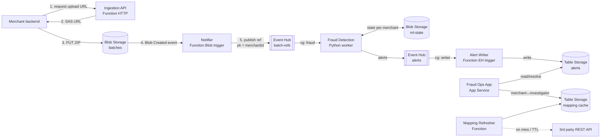

# Assignment B: Fraud Detection in Transaction Batches

**Team:** Simona Strečanská, Martin Lejko
**Course:** NSWI152 — Cloud Application Development
**Cloud:** Microsoft Azure (primary region: West Europe)

This is a solution architecture. No implementation is required. We only use services covered in the course: Azure Functions (HTTP and Event Hub triggers), Blob Storage, Table Storage, Event Hubs, Service Bus, App Service, and OpenTelemetry.

---

## 1. Overview

Merchants send ZIP batches to the cloud. We must:

1. Store every batch durably in Blob Storage.
2. Run a stateful fraud detection algorithm on each batch, in near-real-time, in-order per merchant.
3. Publish fraud alerts to a Fraud Operations App used by investigators.

The design follows three guarantees from the assignment:

- **Correctness:** at-least-once delivery plus idempotent writes. No batch is lost on a transient fault.
- **Cost efficiency:** serverless and consumption-based services. Blob lifecycle tiering.
- **Scalability:** horizontal scale-out driven by Event Hub partitions and Function scaling.

---

## 2. Architecture



### Data flow

1. Merchant calls the **Ingestion API** to get a short-lived SAS upload URL.
2. Merchant uploads the ZIP directly to **Blob Storage**. Large files (up to 1 GiB) never pass through our compute.
3. A **Blob trigger** Function publishes a small *reference message* to the **batch-refs Event Hub**. The message holds the blob path and `merchantId`, not the data itself.
4. The **Fraud Detection** worker consumes references, downloads the batch from Blob, runs the algorithm, and emits alerts to the **alerts Event Hub**.
5. The **Alert Writer** Function stores alerts in **Table Storage**.
6. The **Fraud Ops App** reads alerts and lets investigators resolve them.

### Why upload to Blob directly, not through the API

Event Hub messages are capped at ~1 MB. Batches reach 1 GiB. So we never stream the payload through a queue. We stream only a tiny reference. The merchant writes the big file straight to Blob via SAS. This keeps compute cheap and avoids large request bodies.

---

## 3. Components and ownership

### Cloud Platform Team (C# / Go)

| Component | Hosting | Trigger | Job |
|---|---|---|---|
| Ingestion API | Azure Functions (HTTP) | HTTP | Issue SAS upload URLs |
| Notifier | Azure Functions (Blob) | Blob Created | Publish batch reference to Event Hub |
| Alert Writer | Azure Functions (Event Hub) | alerts Event Hub | Persist alerts to Table Storage |
| Mapping Refresher | Azure Functions (Timer/HTTP) | Timer + on-miss | Cache the 3rd party mapping |

These are short, stateless, I/O-bound jobs. The Consumption plan fits well and scales to zero.

### Machine Learning Team (Python / scikit-learn)

| Component | Hosting | Trigger | Job |
|---|---|---|---|
| Fraud Detection worker | App Service plan (Premium Functions or AKS) | batch-refs Event Hub | Run the stateful algorithm |

See Section 5 for why this one is **not** on the Consumption plan.

### Fraud Operations App Team (enterprise dev)

| Component | Hosting | Job |
|---|---|---|
| Fraud Ops App | Azure App Service | Web/mobile backend for investigators |

They get a simple Table Storage data source and a clean access pattern. They do not touch streaming.

---

## 4. Ordering and the fraud detection worker

The algorithm is stateful and needs all batches from one merchant processed **in-order**.

- **Partition key = `merchantId`.** Event Hub keeps all events with the same key on one partition, in order.
- One partition is read by **one** consumer instance at a time. So one merchant maps to one worker instance. State stays consistent.
- A dedicated **consumer group** for fraud detection keeps it isolated from other readers.

This is the *Sequential Convoy* pattern from Lesson 3.

### State handling

- State is keyed by `merchantId` (one blob per merchant, e.g. `ml-state/{merchantId}.json`).
- On startup or partition reassignment, the worker loads state from Blob.
- While the worker owns the partition, it **caches state in memory**. No reload per batch.
- After processing a batch it persists state, then checkpoints the Event Hub offset. Persist-before-checkpoint keeps the two in sync after a crash.

### Correctness on faults

- Event Hub gives at-least-once delivery. A crash before checkpoint replays the batch.
- Each batch has a stable `batchId`. State writes record the last applied `batchId`. A replayed batch is detected and skipped. So replays are idempotent and results stay 100% correct.

---

## 5. Hosting trade-off for the worker

Constraint: 0.5 s CPU per 1 MiB. A 1 GiB batch = ~512 CPU-seconds (~8.5 min) for one batch.

| Option | Verdict |
|---|---|
| Functions **Consumption** | ✗ 5–10 min hard limit; long batches risk timeout |
| Functions **Premium** plan | ✓ no timeout, Python supported, Event Hub trigger, scales out, simplest |
| **AKS** | ✓ most control, but ML team lacks cloud ops skill; over-engineered here |

**Choice: Functions Premium plan.** It keeps the familiar Event Hub trigger and ordering model, removes the timeout, and stays serverless-ish. AKS is only worth it if the ML team later needs custom GPU images or fine-grained control. We follow "pick the simpler option".

### Scaling and parallelism

- Parallelism = number of Event Hub partitions. Each partition is processed by one worker.
- 100k merchants spread over the partitions. Start with 32 partitions (Standard) and move to a Premium/Dedicated Event Hub if more concurrency is needed.
- Peak load (day, every 30 min) is far higher than night (every 6 h). Premium Functions scale out on partition lag and back down when idle, so we pay for what we use.

---

## 6. Fraud Operations App data design

Investigators need: *all unresolved alerts for all merchants I oversee.* The merchant→investigator mapping comes from the flaky 3rd party API.

### Alerts table

We store the alert under the **investigator**, so a single range query returns their work.

```
Table: alerts
PartitionKey: <investigatorId>
RowKey:       <status>_<timestampDesc>_<alertId>   // status = "0open" or "1done"

merchantId:    string
market:        string
alertId:       string
detectedAt:    DateTime
status:        string  // open | resolved
details:       string
```

- "Unresolved alerts for an investigator" = range query on `PartitionKey = investigatorId` and `RowKey` prefix `0open`. Efficient point/range access only (Lesson 2).
- `timestampDesc` (e.g. `long.MaxValue - ticks`) sorts newest first.
- Resolving an alert moves the row from `0open...` to `1done...` (delete + insert). Both rows share the partition, so it is a single-partition transaction.

The Alert Writer resolves `responsibleInvestigatorId` from the mapping cache (below) when writing each alert.

### Caching the 3rd party mapping

The 3rd party API is slow and unreliable, so we never call it on the request path.

```
Table: mapping_cache
PartitionKey: "merchant"
RowKey:       <merchantId>
investigatorId: string
market:         string
expiresAt:      DateTime
```

- A **Mapping Refresher** Function fills the cache (timer + lazy on miss).
- On expiry we serve stale data and refresh in the background. The mapping changes rarely, so stale-while-revalidate is safe and keeps the app fast even when the 3rd party is down.

---

## 7. Observability (Lesson 4)

### Metrics (3 types)

| Name | Kind | Description | Unit |
|---|---|---|---|
| `batches_ingested_total` | Counter | Batches accepted into Blob | `{batch}` |
| `eventhub_consumer_lag` | Async UpDownCounter | Unprocessed events per partition (queued minus processed) | `{event}` |
| `batch_processing_duration` | Histogram | Wall-clock time to process one batch | `s` |

The counter tracks throughput. The lag gauge warns when the worker falls behind. The histogram shows the processing-time distribution and tail latency.

### Trace: `GET /investigators/{id}/alerts`

Flame graph:

```
GET /investigators/{id}/alerts                      [######################] 86ms
├─ auth.validate                                    [##]                      8ms
├─ mappingCache.lookup (Table query)                [####]                   15ms
└─ alerts.query (Table range query, status=open)    [###############]        60ms
```

Sample spans:

```json
[
  {
    "traceId": "4bf92f3577b34da6a3ce929d0e0e4736",
    "spanId": "00f067aa0ba902b7",
    "parentSpanId": null,
    "name": "GET /investigators/{id}/alerts",
    "kind": "SERVER",
    "startTimeUnixNano": 1717326000000000000,
    "endTimeUnixNano": 1717326000086000000,
    "attributes": {
      "http.request.method": "GET",
      "http.route": "/investigators/{id}/alerts",
      "http.response.status_code": 200,
      "investigator.id": "0c8af4d3-3d3b-4f43-b188-47910f3f00f0"
    }
  },
  {
    "traceId": "4bf92f3577b34da6a3ce929d0e0e4736",
    "spanId": "1a2b3c4d5e6f7890",
    "parentSpanId": "00f067aa0ba902b7",
    "name": "mappingCache.lookup",
    "kind": "CLIENT",
    "startTimeUnixNano": 1717326000008000000,
    "endTimeUnixNano": 1717326000023000000,
    "attributes": {
      "db.system": "azure_table",
      "db.operation": "query",
      "cache.hit": true
    }
  },
  {
    "traceId": "4bf92f3577b34da6a3ce929d0e0e4736",
    "spanId": "2b3c4d5e6f7890ab",
    "parentSpanId": "00f067aa0ba902b7",
    "name": "alerts.query",
    "kind": "CLIENT",
    "startTimeUnixNano": 1717326000026000000,
    "endTimeUnixNano": 1717326000086000000,
    "attributes": {
      "db.system": "azure_table",
      "db.operation": "query",
      "azure.table": "alerts",
      "query.partition_key": "0c8af4d3-...",
      "query.row_key_prefix": "0open",
      "result.count": 42
    }
  }
]
```

Telemetry is exported via OpenTelemetry (OTLP `http/protobuf`) to a backend such as Grafana Cloud, as in Lesson 4.

---

## 8. Limits and trade-offs

- **Partition count caps parallelism.** One merchant = one partition slot at a time. A few very large merchants can create hot partitions. Mitigation: enough partitions and even key distribution.
- **Stale mapping.** We trade strict freshness for availability and speed. Acceptable because the mapping changes rarely.
- **Resolve = delete + insert.** Slightly more work than a property update, but it keeps the "unresolved" query a fast prefix range query.
- **At-least-once + idempotency**, not exactly-once. Simpler and still 100% correct because writes are idempotent on `batchId`.

---

## Bonus 1 — Six regions worldwide

- Deploy the **ingest → store → detect → alert** pipeline independently in each region (Blob, Event Hub, Functions per region). Data is processed where it lands. This keeps latency low and respects data residency.
- The Fraud Ops App stays global. Use **GZRS / RA-GRS** Table Storage, or one alerts store per region with the app querying the investigator's home region.
- Route merchants to their nearest region by market. Ordering per merchant still holds, because a merchant always lands in one region.

## Bonus 2 — Storage cost optimization

Use a **Blob lifecycle policy** on the batches container:

- **Hot** for the first 30 days (active analysis and model retraining).
- After 30 days, move to **Archive** (rarely or never accessed, kept for unexpected future use).

Archive is the cheapest tier (offline, retrieval in hours). The 180-day minimum is fine because we keep the data long-term anyway. Lifecycle policies are free; we pay only the tier-change operation. This cuts storage cost dramatically while preserving the data.

## Bonus 3 — List all merchants in a market

Maintain our own **market index** as the Mapping Refresher fills the cache:

```
Table: market_index
PartitionKey: <market>      // e.g. "de-de"
RowKey:       <merchantId>
```

"All merchants in a market" = one partition range query. The Fraud Ops App reads it directly. No inefficient fan-out against the slow 3rd party API.

---

## Sources

- [Azure Event Hubs — features and terminology](https://learn.microsoft.com/en-us/azure/event-hubs/event-hubs-features)
- [Azure Well-Architected — Event Hubs](https://learn.microsoft.com/en-us/azure/well-architected/service-guides/azure-event-hubs)
- [Event Hubs with Azure Functions — performance and scale](https://learn.microsoft.com/en-us/azure/architecture/serverless/event-hubs-functions/performance-scale)
- [Blob Storage lifecycle management overview](https://learn.microsoft.com/en-us/azure/storage/blobs/lifecycle-management-overview)
- [Blob access tiers (hot / cool / cold / archive)](https://learn.microsoft.com/en-us/azure/storage/blobs/access-tiers-overview)
- [Sequential Convoy pattern](https://learn.microsoft.com/en-us/azure/architecture/patterns/sequential-convoy)
</content>
</invoke>
