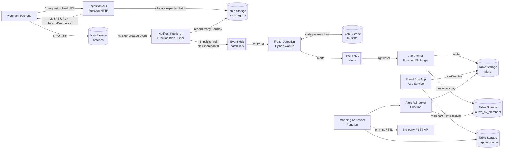

# Assignment B: Fraud Detection in Transaction Batches

**Team:** Simona Strečanská, Martin Lejko
**Course:** NSWI152 — Cloud Application Development
**Cloud:** Microsoft Azure (primary region: West Europe)

This is a solution architecture. No implementation is required. We only rely on services covered in the course: Azure Functions (HTTP, Blob, Timer, and Event Hub triggers), Blob Storage, Table Storage, Event Hubs, App Service, and OpenTelemetry.

---

## 1. Overview

Merchants send ZIP batches to the cloud. We must:

1. Store every batch durably in Blob Storage.
2. Run a stateful fraud detection algorithm on each batch, in near-real-time, in-order per merchant.
3. Publish fraud alerts to a Fraud Operations App used by investigators.

The design follows three guarantees from the assignment:

- **Correctness:** at-least-once delivery plus idempotent writes. No batch is lost on a transient fault.
- **Cost efficiency:** serverless and consumption-based services. Blob lifecycle tiering.
- **Scalability:** horizontal scale-out driven by Event Hub partitions and Function scaling.

---

## 2. Architecture



### Data flow

1. Merchant calls the **Ingestion API** to get a short-lived SAS upload URL, stable `batchId`, next `batchSequence` for this merchant, and a deterministic blob path. Before returning the SAS URL, the API creates an `allocated` registry row for that expected batch.
2. Merchant uploads the ZIP directly to **Blob Storage**. Large files (up to 1 GiB) never pass through our compute.
3. A **Blob Created event** triggers the Notifier. The Notifier verifies the expected blob path/metadata, records the batch as ready, and writes a durable outbox row.
4. The Notifier publishes a small *reference message* to the **batch-refs Event Hub**. The message holds the blob path, `merchantId`, `batchId`, and `batchSequence`, not the data itself. A timer retry scans `allocated` registry rows, checks whether the blob exists, records missed blobs as ready, and republishes ready outbox rows after transient Blob trigger or Event Hub failures.
5. The **Fraud Detection** worker consumes references, downloads the batch from Blob, runs the algorithm, and emits alerts to the **alerts Event Hub**.
6. The **Alert Writer** Function stores alerts in **Table Storage**.
7. The **Fraud Ops App** reads alerts and lets investigators resolve them.

### Why upload to Blob directly, not through the API

Event Hub messages are capped at ~1 MB. Batches reach 1 GiB. So we never stream the payload through a queue. We stream only a tiny reference. The merchant writes the big file straight to Blob via SAS. This keeps compute cheap and avoids large request bodies.

### Batch registry / outbox schema

The registry and outbox share one Table Storage table partitioned by merchant, so sequence checks are efficient range queries:

```
Table: batch_registry
PartitionKey: <merchantId>
RowKey:       <batchSequencePadded>

batchId:         string
blobPath:        string
status:          string  // allocated | ready | published | gap
uploadExpiresAt: DateTime
publishedAt:     DateTime?
```

The Ingestion API creates an `allocated` row with a unique `batchSequence`, using a conditional update on a per-merchant counter row in the same partition to avoid races between concurrent upload requests. The Notifier updates the same row to `ready` after the blob exists. The Publisher scans the merchant partition from the last published sequence, publishes only contiguous `ready` rows, and marks them `published`. Conditional updates make duplicate Blob events and timer retries idempotent.

---

## 3. Components and ownership

### Cloud Platform Team (C# / Go)

| Component | Hosting | Trigger | Job |
|---|---|---|---|
| Ingestion API | Azure Functions (HTTP) | HTTP | Issue SAS upload URLs and stable batch IDs |
| Notifier / Publisher | Azure Functions (Blob + Timer) | Blob Created + retry timer | Validate uploaded blobs, keep a durable outbox, publish ordered batch references to Event Hub |
| Alert Writer | Azure Functions (Event Hub) | alerts Event Hub | Persist alerts to Table Storage |
| Mapping Refresher | Azure Functions (Timer/HTTP) | Timer + on-miss | Cache the 3rd party mapping |
| Alert Reindexer | Azure Functions (Timer) | Table-backed mapping-change work item + retry timer | Move open alert index rows when merchant ownership changes |

These are short, stateless, I/O-bound jobs. The Consumption plan fits well and scales to zero.

### Machine Learning Team (Python / scikit-learn)

| Component | Hosting | Trigger | Job |
|---|---|---|---|
| Fraud Detection worker | Azure Functions Premium | batch-refs Event Hub | Run the stateful algorithm |

See Section 5 for why this one is **not** on the Consumption plan.

### Fraud Operations App Team (enterprise dev)

| Component | Hosting | Job |
|---|---|---|
| Fraud Ops App | Azure App Service | Web/mobile backend for investigators |

They get a simple Table Storage data source and a clean access pattern. They do not touch streaming.

### Custom operations and dependencies

| Operation | Direct dependencies | Transitive dependencies |
|---|---|---|
| `POST /batch-uploads` | Blob Storage SAS generation, batch registry table | Merchant authentication |
| Blob Created notifier / publisher | Blob Storage, batch registry/outbox table, batch-refs Event Hub | Ingestion API batch ID and sequence allocation |
| Fraud Detection worker | batch-refs Event Hub, batches Blob container, ML state Blob container, alerts Event Hub | Notifier ordering protocol |
| Alert Writer | alerts Event Hub, alerts Table Storage, alerts_by_merchant Table Storage, mapping cache Table Storage | Mapping Refresher |
| `GET /investigators/{id}/alerts` | alerts Table Storage | Mapping Refresher and alert reindexing |
| Resolve alert endpoint | alerts Table Storage | Mapping Refresher |
| Mapping Refresher | 3rd party REST API, mapping cache Table Storage, market index Table Storage | Alert Reindexer |
| Alert Reindexer | mapping cache Table Storage, alerts Table Storage, alerts_by_merchant Table Storage | Mapping Refresher |

---

## 4. Ordering and the fraud detection worker

The algorithm is stateful and needs all batches from one merchant processed **in-order**.

- **Partition key = `merchantId`.** Event Hub keeps all events with the same key on one partition, in order.
- **Business sequence = `batchSequence`.** The Notifier / Publisher publishes only contiguous ready batches per merchant. If batch 124 is ready before 123, it waits until 123 is ready. A bounded wait guards against an upload that was allocated but never delivered: after the SAS upload URL has expired, a grace period has passed, and Blob Storage still confirms the expected blob is absent, the publisher emits a gap marker and releases the later batches so one missing upload cannot stall a merchant forever (see Limits).
- One partition is read by **one** consumer instance at a time. So one merchant maps to one worker instance. State stays consistent.
- A dedicated **consumer group** for fraud detection keeps it isolated from other readers.

This is the *Sequential Convoy* pattern from Lesson 3.

### State handling

- State is keyed by `merchantId` (one blob per merchant, e.g. `ml-state/{merchantId}.json`).
- On startup or partition reassignment, the worker loads state from Blob.
- While the worker owns the partition, it **caches state in memory**. No reload per batch.
- After processing a batch it first publishes all generated alerts durably to the alerts Event Hub, then persists ML state, then checkpoints the batch-refs Event Hub offset. Persist-before-checkpoint keeps the two in sync after a crash, and alert-before-state prevents committed state without durable alert output.

### Correctness on faults

- Event Hub gives at-least-once delivery. A crash before checkpoint replays the batch.
- Each batch has a stable `batchId` and `batchSequence`. State records the last committed sequence. A replayed batch is detected and skipped only after its alerts were already published durably.
- Alert IDs are deterministic, e.g. `hash(merchantId, batchSequence, findingType, findingNaturalKey)`. The Alert Writer upserts deterministic canonical and investigator-index rows, so duplicated alert events do not create duplicate alerts.
- The Alert Writer checkpoints the alerts Event Hub only after both the canonical row and the investigator index row are written.

| Failure point | Recovery |
|---|---|
| Crash before alert publication | No state update and no checkpoint; Event Hub replays the batch. |
| Crash after alert publication but before state update | Replay republishes the same deterministic alert IDs; Alert Writer deduplicates. |
| Crash after state update but before checkpoint | Replay sees the committed sequence and checkpoints; alerts are already durable because they were published before state update. |
| Alert Writer crash after partial writes | alerts Event Hub replays; deterministic row keys fill missing rows without duplicates. |

---

## 5. Hosting trade-off for the worker

Constraint: 0.5 s CPU per 1 MiB. A 1 GiB batch = ~512 CPU-seconds (~8.5 min) for one batch.

| Option | Verdict |
|---|---|
| Functions **Consumption** | ✗ 5–10 min hard limit; long batches risk timeout |
| Functions **Premium** plan | ✓ no timeout, Python supported, Event Hub trigger, scales out, simplest |
| **AKS** | ✓ most control, but ML team lacks cloud ops skill; over-engineered here |

**Choice: Functions Premium plan.** It keeps the familiar Event Hub trigger and ordering model, removes the timeout, and stays serverless-ish. AKS is only worth it if the ML team later needs custom GPU images or fine-grained control. We follow "pick the simpler option".

### Scaling and parallelism

- Parallelism = number of Event Hub partitions. Each partition is processed by one worker at a time.
- Required worker CPU can be estimated as `100000 / 1800 * averageBatchSizeMiB * 0.5`. For example, 10 MiB average batches during the 30-minute day period need about 278 vCPU to keep up in real time.
- Partition count is sized up front for the target throughput: it must be at least the number of batches that have to run concurrently to keep up. The ~278 vCPU above implies on the order of a few hundred partitions for the 10 MiB-average day period (one batch per partition at a time), so we provision a comparable partition count plus headroom. We avoid changing partition count dynamically because ordering depends on `merchantId` partitioning.
- For normal load we use a single Event Hub with enough partitions. If capacity planning requires hundreds of concurrent partitions, we keep the same logical design but use Event Hubs Dedicated for `batch-refs`, or split merchants by stable market/hash bucket across several identically configured Event Hubs. This is a capacity choice, not a change in the ordering protocol: inside each hub the partition key is still `merchantId`.
- Peak load (day, every 30 min) is far higher than night (every 6 h). Premium Functions scale out on partition lag and back down when idle, so we pay for what we use.
- A single very large merchant is a hot key by design. Its batches cannot be processed in parallel without breaking the algorithm's in-order requirement.

---

## 6. Fraud Operations App data design

Investigators need: *all unresolved alerts for all merchants I oversee.* The merchant→investigator mapping comes from the flaky 3rd party API.

### Alerts table

We store the alert under the **investigator**, so a single range query returns their work.

```
Table: alerts
PartitionKey: <investigatorId>
RowKey:       <status>_<timestampDesc>_<alertId>   // status = "0open" or "1done"

merchantId:    string
market:        string
alertId:       string
detectedAt:    DateTime
status:        string  // open | resolved
details:       string
mappingVersion: long
```

- "Unresolved alerts for an investigator" = range query on `PartitionKey = investigatorId` and `RowKey` prefix `0open`. Efficient point/range access only (Lesson 2).
- `timestampDesc` (e.g. `long.MaxValue - ticks`) sorts newest first.
- Resolving an alert moves the row from `0open...` to `1done...` (delete + insert). Both rows share the partition, so it is a single-partition transaction.

The Alert Writer resolves `responsibleInvestigatorId` from the mapping cache (below) when writing each alert.

To make reassignment safe, we also keep a canonical copy of each alert keyed by merchant:

```
Table: alerts_by_merchant
PartitionKey: <merchantId>
RowKey:       <alertId>
```

If the Mapping Refresher later observes that a merchant moved to another investigator, an Alert Reindexer reads open rows from `alerts_by_merchant`, inserts equivalent `0open...` rows under the new investigator, and deletes old open rows under the previous investigator. It processes bounded pages of rows per timer invocation, so it stays a short Function job and resumes safely after failures. If no mapping is known yet, the alert is kept canonically and temporarily indexed under `unassigned`; it is moved once the mapping is discovered.

### Caching the 3rd party mapping

The 3rd party API is slow and unreliable, so we never call it on the request path.

```
Table: mapping_cache
PartitionKey: "merchant"
RowKey:       <merchantId>
investigatorId: string
market:         string
mappingVersion: long      // monotonic refresh counter, bumped on each successful fetch
expiresAt:      DateTime
```

- A **Mapping Refresher** Function fills the cache (timer + lazy on miss). Each successful fetch bumps `mappingVersion`. "A newer mapping is observed" means the freshly fetched `investigatorId` differs from the cached one; the new (higher) `mappingVersion` is then stamped onto reindexed alert rows so reindexing is idempotent and ordered.
- On expiry we serve stale data and refresh in the background. The mapping changes rarely, so stale-while-revalidate is safe and keeps the app fast even when the 3rd party is down.
- The 3rd party API has no change feed, so strict real-time reassignment while it is down is impossible. The system is correct for the latest mapping version it has observed and repairs alert indexes after a newer mapping is successfully fetched.

---

## 7. Observability (Lesson 4)

### Metrics (3 types)

| Name | Kind | Description | Unit |
|---|---|---|---|
| `batches_ingested_total` | Counter | Batches accepted into Blob | `{batch}` |
| `eventhub_consumer_lag` | Async UpDownCounter | Unprocessed events per partition (queued minus processed) | `{event}` |
| `batch_processing_duration` | Histogram | Wall-clock time to process one batch | `s` |

The counter tracks throughput. The lag metric (async UpDownCounter) warns when the worker falls behind. The histogram shows the processing-time distribution and tail latency.

### Trace: `GET /investigators/{id}/alerts`

Flame graph:

```
GET /investigators/{id}/alerts                      [######################] 86ms
├─ auth.validate                                    [##]                      8ms
├─ mappingCache.lookup (Table query)                [####]                   15ms
└─ alerts.query (Table range query, status=open)    [###############]        60ms
```

Sample spans:

```json
[
  {
    "traceId": "4bf92f3577b34da6a3ce929d0e0e4736",
    "spanId": "00f067aa0ba902b7",
    "parentSpanId": null,
    "name": "GET /investigators/{id}/alerts",
    "kind": "SERVER",
    "startTimeUnixNano": 1717326000000000000,
    "endTimeUnixNano": 1717326000086000000,
    "attributes": {
      "http.request.method": "GET",
      "http.route": "/investigators/{id}/alerts",
      "http.response.status_code": 200,
      "investigator.id": "0c8af4d3-3d3b-4f43-b188-47910f3f00f0"
    }
  },
  {
    "traceId": "4bf92f3577b34da6a3ce929d0e0e4736",
    "spanId": "1a2b3c4d5e6f7890",
    "parentSpanId": "00f067aa0ba902b7",
    "name": "mappingCache.lookup",
    "kind": "CLIENT",
    "startTimeUnixNano": 1717326000008000000,
    "endTimeUnixNano": 1717326000023000000,
    "attributes": {
      "db.system": "azure_table",
      "db.operation": "query",
      "cache.hit": true
    }
  },
  {
    "traceId": "4bf92f3577b34da6a3ce929d0e0e4736",
    "spanId": "2b3c4d5e6f7890ab",
    "parentSpanId": "00f067aa0ba902b7",
    "name": "alerts.query",
    "kind": "CLIENT",
    "startTimeUnixNano": 1717326000026000000,
    "endTimeUnixNano": 1717326000086000000,
    "attributes": {
      "db.system": "azure_table",
      "db.operation": "query",
      "azure.table": "alerts",
      "query.partition_key": "0c8af4d3-...",
      "query.row_key_prefix": "0open",
      "result.count": 42
    }
  }
]
```

Telemetry is exported via OpenTelemetry (OTLP `http/protobuf`) to a backend such as Grafana Cloud, as in Lesson 4.

---

## 8. Limits and trade-offs

- **Partition count caps parallelism.** One merchant = one partition slot at a time. A few very large merchants can create hot partitions. Mitigation: enough partitions and even key distribution.
- **Stale mapping.** We trade strict freshness for availability and speed. Acceptable because the mapping changes rarely.
- **Resolve = delete + insert.** Slightly more work than a property update, but it keeps the "unresolved" query a fast prefix range query.
- **At-least-once + idempotency**, not exactly-once. Simpler and still 100% correct because writes are idempotent on `batchId`/`alertId`.
- **Contiguous ordering vs. a missing upload.** Publishing only contiguous `batchSequence` values means one allocated upload that is never delivered would block all later batches for that merchant. We bound the wait by the SAS expiry plus a grace period and emit a gap marker only after the expected blob is confirmed absent. A late upload after expiry is rejected or quarantined and must be resent as a new batch, preserving in-order processing for all batches actually accepted by the cloud.

---

## Bonus 1 — Six regions worldwide

- Deploy the **ingest → store → detect → alert** pipeline independently in each region (Blob, Event Hub, Functions per region). Data is processed where it lands. This keeps latency low and respects data residency.
- The Fraud Ops App is deployed globally on App Service behind a global router. It reads regional alert stores according to the investigator's region/market assignments. Use **GZRS / RA-GRS** for disaster recovery, but keep active writes regional so cross-region replication lag does not affect correctness.
- Route each merchant to one stable home region by market or merchant configuration. Ordering per merchant still holds, because all batches from that merchant enter the same regional Event Hub.

## Bonus 2 — Storage cost optimization

Use a **Blob lifecycle policy** on the batches container:

- **Hot** for the first 30 days (active analysis and model retraining).
- After 30 days, move to **Archive** (rarely or never accessed, kept for unexpected future use).

Archive is the cheapest tier (offline, retrieval in hours). The 180-day minimum is fine because we keep the data long-term anyway. Lifecycle policies are free; we pay only the tier-change operation. This cuts storage cost dramatically while preserving the data.

## Bonus 3 — List all merchants in a market

Maintain our own **market index** as the Mapping Refresher fills the cache:

```
Table: market_index
PartitionKey: <market>      // e.g. "de-de"
RowKey:       <merchantId>
```

"All merchants in a market" = one partition range query. The Fraud Ops App reads it directly. No inefficient fan-out against the slow 3rd party API.

The index contains merchants known from ingestion and merchants discovered through investigator mapping refreshes. The 3rd party API has no "list all merchants" endpoint, so a completely inactive merchant that never appears in either source cannot be discovered proactively.

---

## Sources

- [Azure Event Hubs — features and terminology](https://learn.microsoft.com/en-us/azure/event-hubs/event-hubs-features)
- [Azure Event Hubs — compare tiers and quotas](https://learn.microsoft.com/en-us/azure/event-hubs/compare-tiers)
- [Azure Well-Architected — Event Hubs](https://learn.microsoft.com/en-us/azure/well-architected/service-guides/azure-event-hubs)
- [Event Hubs with Azure Functions — performance and scale](https://learn.microsoft.com/en-us/azure/architecture/serverless/event-hubs-functions/performance-scale)
- [Blob Storage lifecycle management overview](https://learn.microsoft.com/en-us/azure/storage/blobs/lifecycle-management-overview)
- [Blob access tiers (hot / cool / cold / archive)](https://learn.microsoft.com/en-us/azure/storage/blobs/access-tiers-overview)
- [Sequential Convoy pattern](https://learn.microsoft.com/en-us/azure/architecture/patterns/sequential-convoy)
